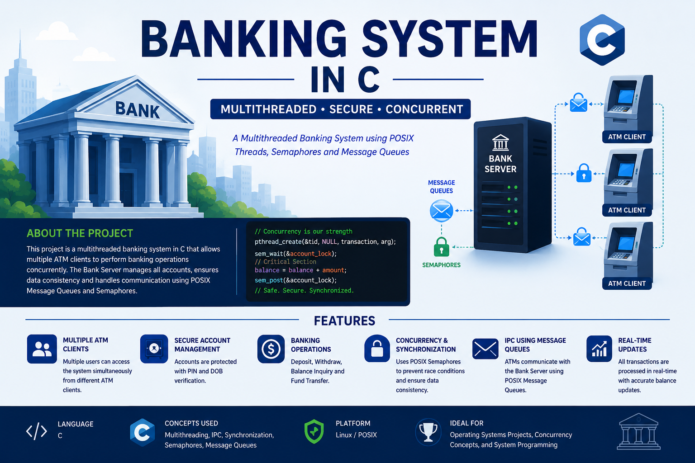

<p align="center">
  
</p>

<h1 align="center">🏦 Multithreaded Bank & ATM System in C</h1>

<p align="center">
A concurrent banking simulation using <b>C</b>, <b>POSIX Threads</b>, <b>Semaphores</b>, and <b>Message Queues (IPC)</b>.
</p>

<p align="center">
  
  
  
</p>

---

## 📖 Overview

This project simulates a **Bank Server** and multiple **ATM Clients** communicating through **POSIX Message Queues (IPC)**.

The system demonstrates important Operating System concepts such as:

- Concurrency
- Synchronization
- Semaphores & Mutexes
- Inter-Process Communication (IPC)
- Safe concurrent transactions

Multiple ATM clients can perform:

- 💰 Deposit
- 💸 Withdraw
- 🔍 View Account Details

simultaneously while maintaining data consistency.

---

## ✨ Features

- Multiple customer accounts
- Concurrent ATM transactions
- Semaphore & mutex synchronization
- POSIX message queue communication
- Safe shared resource handling
- Menu-driven ATM interface

---

## 📂 Files

| File | Description |
|---|---|
| `bank_server.c` | Bank server logic and transaction handling |
| `atm.c` | ATM client interface |
| `runs_atms.sh` | Launch multiple ATM clients |
| `README.md` | Project documentation |

---

## ⚙️ Requirements

- Ubuntu-based OS
- GCC Compiler
- POSIX Thread Library (`-lpthread`)
- Real-Time Library (`-lrt`)

---

## 🚀 Compilation

```bash
gcc bank_server.c -o bank_server -lpthread -lrt
gcc atm.c -o atm -lrt
```

---

## ▶️ Run the Project

### Start Bank Server

```bash
./bank_server
```

### Start ATM Client

```bash
./atm
```

### Run Multiple ATM Clients

```bash
chmod +x runs_atms.sh
./runs_atms.sh
```

---

## 🧠 Concepts Used

- POSIX Threads
- Message Queues
- Semaphores
- Mutex Locks
- Process Synchronization
- Concurrent Programming

---

## 👨‍💻 Developed For

Operating Systems & System Programming Concepts
